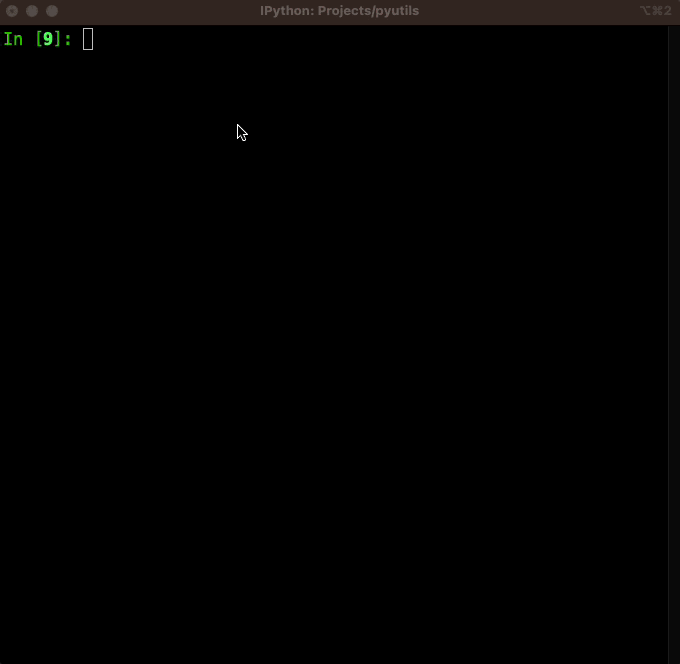

# Python Utitlies
Various python modules that can be used by other python projects.

## InteractiveCli
### [cli.py](https://github.com/henrydho/pyutils/blob/main/cli.py)

### Example


## RemoteClient
### [remoteclient.py](https://github.com/henrydho/pyutils/blob/main/remoteclient.py)

### Prerequisites
Install the following python packages:
* paramiko==2.8.0
* jumpssh
* loguru

```bash
python3 -m pip install paramiko==2.8.0 jumpssh loguru
```

### Example
```python
# Import RemoteClient module
from remoteclient import RemoteClient

# Instantiate new RemoteClient
ssh_client = RemoteClient()

# SSH to the jump server
jump_session = ssh_client.connect_jump_session(
    jump_host='jump-server-ip-or-fqdn'
    )

# SSH to the remote host
remote_session = ssh_client.connect_remote_session(
    jump_session=jump_session,
    remote_host='remote-host-ip-or-fqdn'
    )

# Run the commands `date` and `pwd` on the jump server
ssh_client.run_cmd(
    ssh_session=jump_session,
    commands=['date', 'pwd']
    )

# Run the commands `date` and `pwd` on the remote host
ssh_client.run_cmd(
    ssh_session=remote_session,
    commands=['date', 'pwd']
    )

# Disconnect the SSH session of remote host
ssh_client.disconnect(
    ssh_session=remote_session
    )

# Disconnect the SSH session of jump server
ssh_client.disconnect(
    ssh_session=jump_session
    )
```
